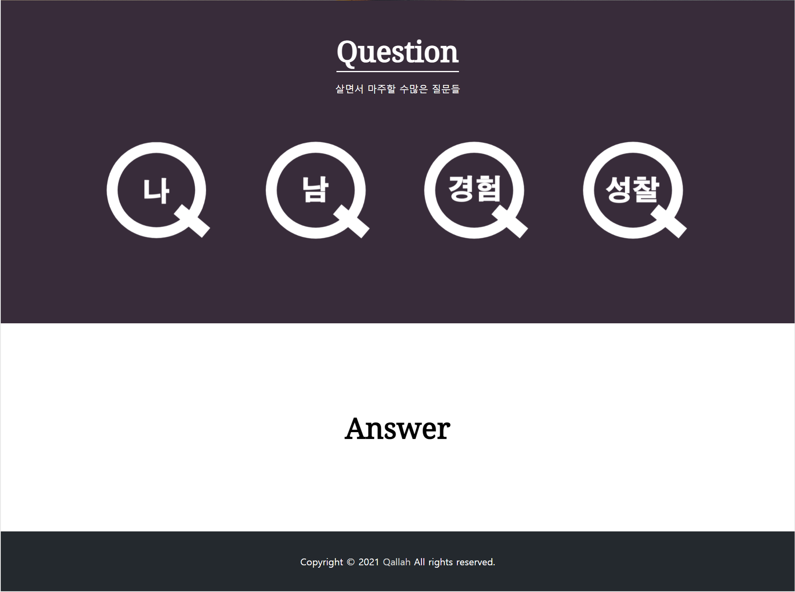
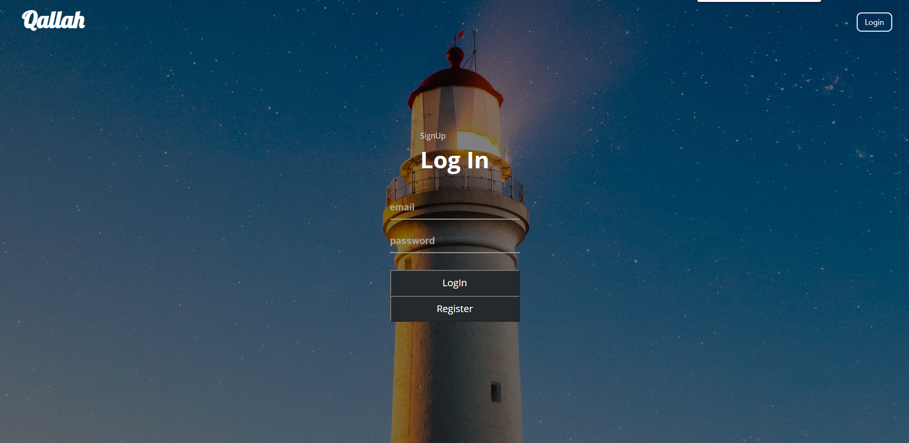
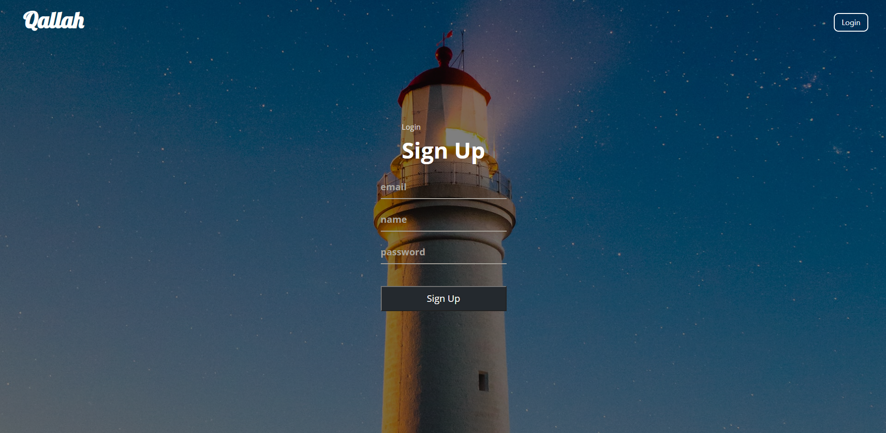
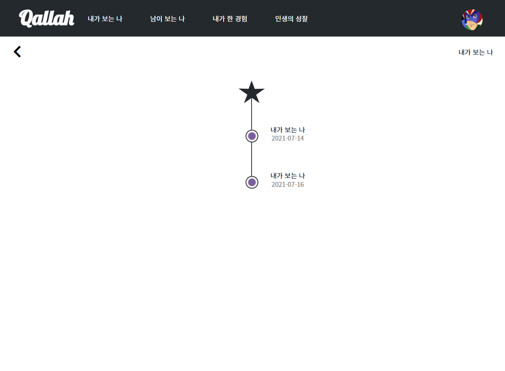
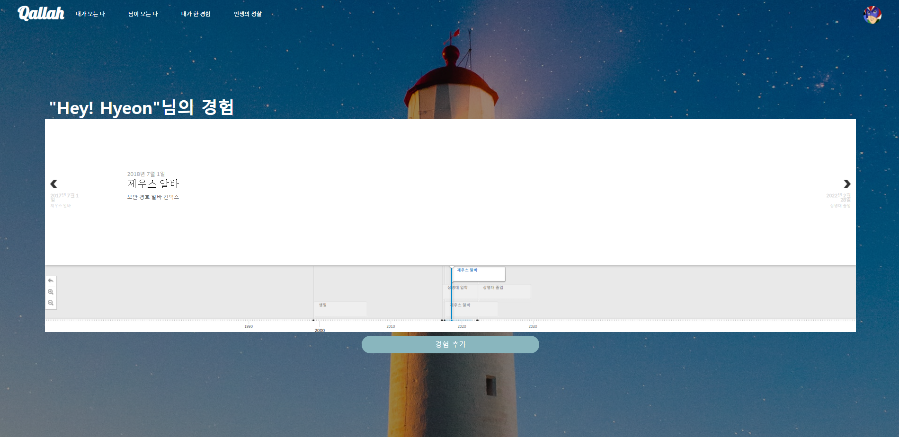
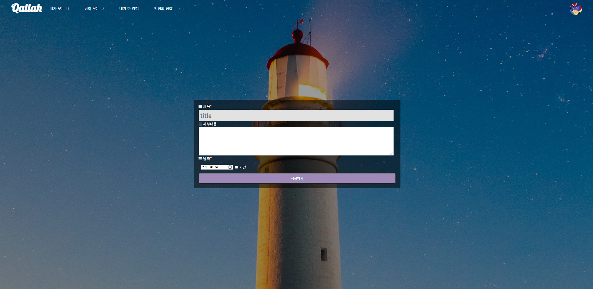
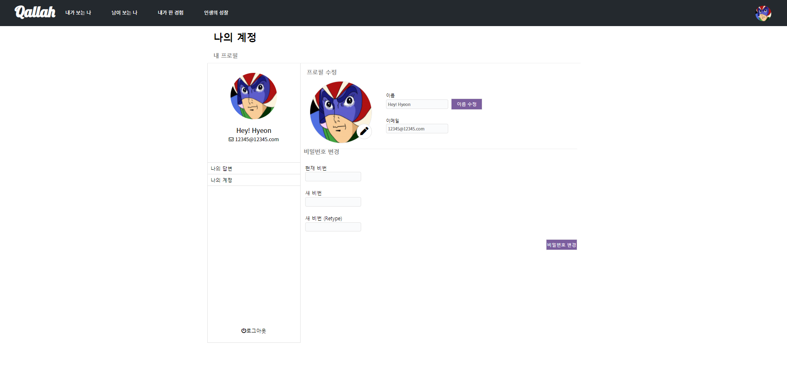
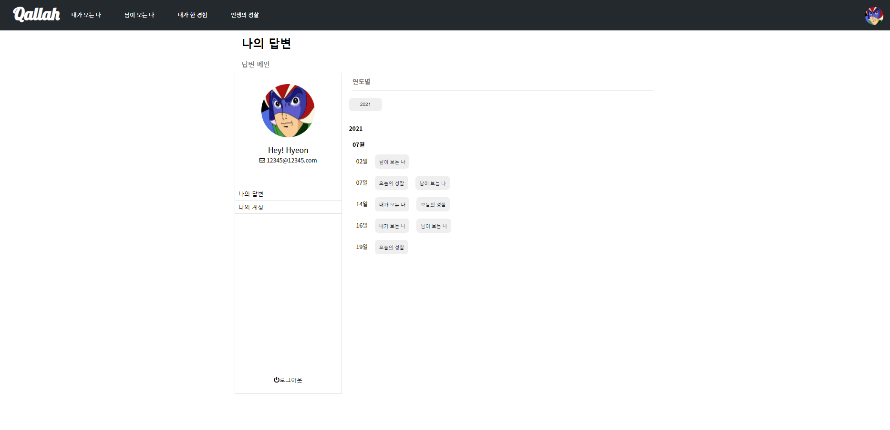
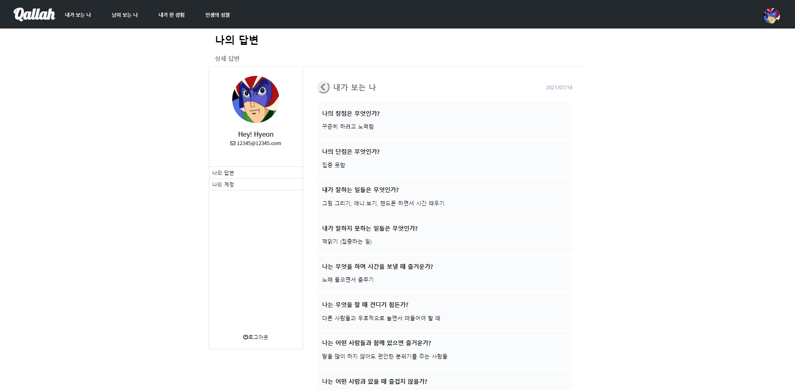
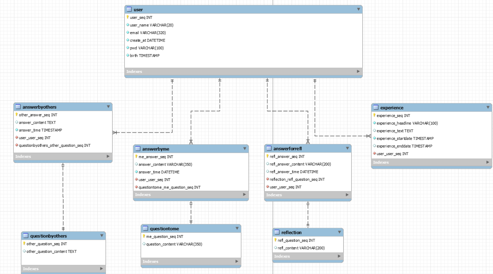

<h3 align='middle'> 질문과 답변 성찰 페이지 Qallah</h3>
                 

---

## 참여자

- **기간 : 2개월**
- **팀원 : 황현정, 서충식, 서찬식**

- **Qallah팀** 
  [황현정](https://github.com/giraff)  
  [서충식](https://github.com/seo-rio)  
  [서찬식](https://github.com/coldexpression)  

---

## 시스템 소개

### Qallah
> 주어진 질문에 답변을 하면서 내 자신을 성찰하는 질문 & 답변 사이트

😃 *React 및 프론트엔드 공부* 

😃 *순수 CSS로 레이아웃, 반응형, Modal, hamburger menu 등 UI/UX 구현 (No Bootstrap)* 

*😃 주어진 질문에 답변을 하면서 내 자신을 성찰하는 질문 & 답변 사이트* 

*😃 Question + allah (너 자신을 알라 ) :* 질문을 통해 '내 자신을 알아가자'는 의미를 담아았습니다.

## 사용 방법

- 하루에 한 번, 질문에 답할 수 있고, 작성한 답변들은 한 번 저장된 후 하루 동안 수정, 다시 작성이 가능합니다.
- 작성한 답변은 나의 답변 페이지에서 연도별로 확인할 수 있습니다.
- 내가 한 경험 페이지에 timeline.JS를 도입해 경험을 작성하면 타임 라인 형태로 확인할 수 있습니다
- 현재 질문 생성은 관리자만 할 수 있습니다.

### 사용기술 (수정 예정)

- View : React
- Data-binding: redux
- Ajax: Axios
- Router: react-router
- BackEnd : Express
- Server : Node.js
- hosting: Naver Cloud platform
- Storage: AWS S3
- DB : MariaDB
- 개발 환경
  - Source Tree: Git GUI tool
  - Heidi SQL : DB GUI tool
  - VSC : IDE, Code Editor
  - Github, Github Issue : 이슈 관리
  - Notion : 문서화 도구
  - Figma: 스토리보드 작성 및 프로토타이핑 용도

### 화면 구성 UI

<table>
  <tr>
    <th align='middle'></th>
  </tr>
  <tr>
    <td align='middle'><strong>메인 배너</strong></td>
  </tr>
  <tr>
    <td align='middle'></th>
  </tr>
  <tr>
    <td align='middle'><strong>메인 컨텐츠</strong> </td>
  </tr>
  <tr>
    <td align='middle'>
  로그인</td>
    
  </tr>
  <tr>
    <td align='middle'><strong>로그인 페이지</strong></td>
  </tr>
  <tr>
    <td align='middle'></td>
  </tr>
  <tr>
    <td align='middle'><strong>회원가입 페이지</strong></td>
  </tr>
  <tr>
    <td align='middle'></td>
  </tr>
  <tr>
    <td align='middle'><strong>내가 보는 나/ 남이 보는 나/ 인생의 성찰 질문 컴포넌트 시작 페이지</strong></td>
  </tr>
  <tr>
    <td align='middle'></td>
  </tr>
  <tr>
    <td align='middle'><strong>질문/답변 컴포넌트</strong></td>
  </tr>
  <tr>
    <td align='middle'>일자 순서대로 작성한 것들을 한 눈에 볼 수 있습니다.</td>
  </tr>
  <tr>
    <td align='middle'><strong>질문/답변 히스토리</strong></td>
  </tr>
  <tr>
    <td align='middle'></td>
  </tr>
  <tr>
    <td align='middle'><strong>내가 한 경험 메인 페이지</strong></td>
  </tr>
  <tr>    
    <td align='middle'></td>
  </tr>
  <tr>
    <td align='middle'><strong>내가 한 경험 작성 페이지</strong></td>
  </tr>
  <tr>
    <td align='middle'>로그인 후 사용자 이름/ 이미지/ 비밀번호를 변경할 수 있습니다.</td>
  </tr>
  <tr>
    <td align='middle'><strong>나의 계정 페이지</strong></td>
  </tr>
  <tr>
    <td align='middle'>일자 순서대로 작성한 것들을 한 눈에 볼 수 있습니다.</td>
  </tr>
  <tr>
    <td align='middle'><strong>나의 답변 메인 페이지</strong></td>
  </tr>
  <tr>
    <td align='middle'>

작성한 답변을 디테일하게 조회할 수 있습니다.</td>
  </tr>
  <tr>
    <td align='middle'><strong>나의 답변 > 상세 답변 </strong></td>
  </tr>
</table>

### 시스템 아키텍처

### ER 다이어그램

### 앞으로 남은 과제및 고려하는 부분
1. 반응형 웹페이지 완수
2. 도메인 (option)
3. 기능 추가 & 개선
  1. 주제별 답변 보기 (연도별 답변만 볼 수 있는데 주제별, 질문별 추가. 답변 View 선택 사항 늘리기)
  2. 답변 삭제 기능 
    - 내가 보는 나 / 남이 보는 나/ 인생의 성찰 => 답변 페이지에서 답변 컴포넌트 삭제 기능
    - 내가 한 경험 : 경험 컴포넌트 삭제 기능
  4. 회원 탈퇴 기능 (DB에서 정보 완전히 제거)
  5. 이메일 인증 기능 및 보안 강화
4. CSS 개선
